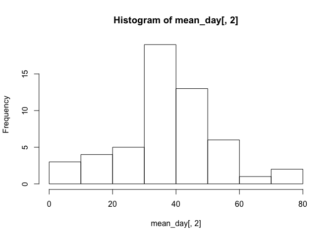

# Reproducible Research: Peer Assessment 1

This is my submission for Peer Assignment 1.

Ensure that you have the activity.csv file in the RepData_PeerAssessment1 directory,
which should be in your working directory.

Make sure you are using the .csv version, NOT the .zip version (i.e. unzip the file)

## Loading and preprocessing the data

```r
activity <- read.csv("activity.csv")
```

## What is mean total number of steps taken per day?

```r
activity$day <- as.numeric(activity[ , 2], format='%d')
meandata <- aggregate(activity$steps, by=list(activity$day), FUN=mean, na.action = na.omit)
hist(meandata[ ,2])
```

 

## What is the average daily activity pattern?


## Imputing missing values


## Are there differences in activity patterns between weekdays and weekends?
